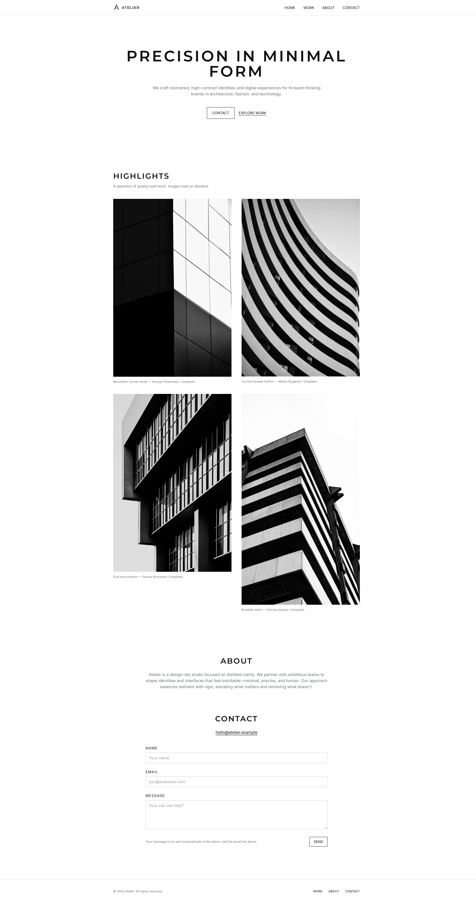
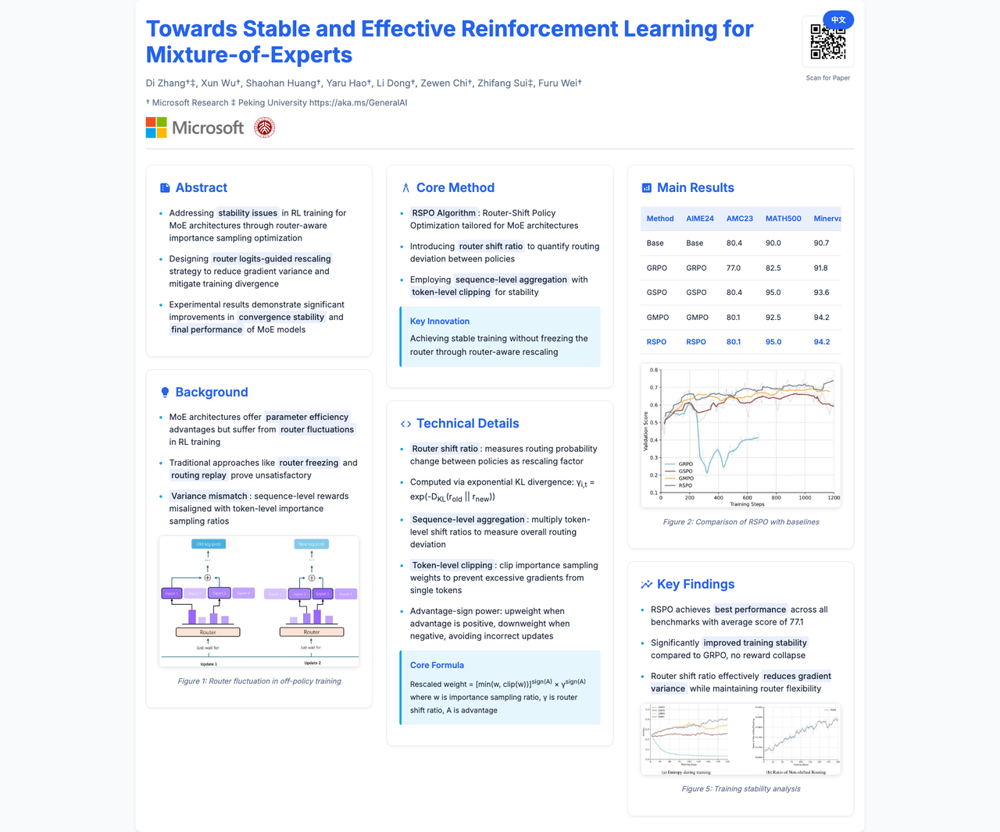
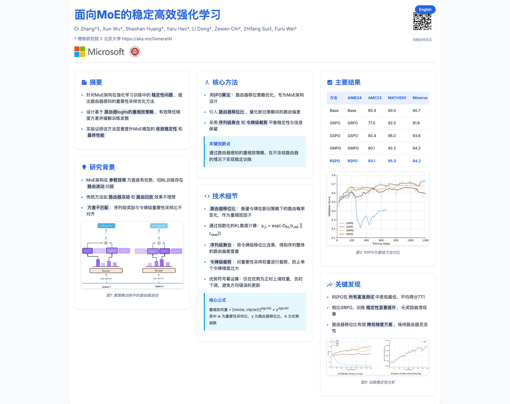

# NexHTML

基于 Nexau 框架的 AI Agent 集合，帮你自动生成 HTML 页面和学术海报。

[English](README.md) | [中文](README_CN.md)

## 项目简介

NexHTML 是基于 [Nexau 框架](https://github.com/nex-agi/NexAU) 开发的 AI Agent 平台，目前包含两个 Agent：
- **WebDevAgent**：自动生成 HTML 网页
- **Paper2PosterAgent**：将学术论文转换为海报

## 案例展示

### WebDevAgent 示例



[查看提示词](docs/prompts/webdev_case1_prompt.md)


[查看提示词](docs/prompts/webdev_case2_prompt.md)

### Paper2PosterAgent 示例

 

## 功能介绍

### WebDevAgent

自动生成 HTML 网页，包含：
- 自动搜索配图（Unsplash API）
- AI 自动为图片添加文字说明
- 支持多轮对话优化代码

### Paper2PosterAgent

将 PDF 论文转换为学术海报，包含：
- 解析 PDF 提取内容和图片（基于 MinerU）
- AI 为图片生成标题和描述
- 自动添加学校 Logo
- 生成论文二维码

## 快速开始

### 1. 安装

需要 Python 3.13+

```bash
# 克隆项目
git clone https://github.com/nex-agi/NexHTML.git
cd NexHTML
git submodule update --init --recursive

# 一键安装所有依赖（包括 MinerU 和 Nexau）
uv pip install -e .
```

### 2. 配置

复制 `.env.example` 为 `.env`，填入你的 API Key：

```bash
cp .env.example .env
```

编辑 `.env` 文件：

```bash
# 必填：LLM 配置
LLM_MODEL=你的模型名
LLM_BASE_URL=https://api.openai.com/v1
LLM_API_KEY=你的API密钥

# 可选：WebDevAgent 需要
UNSPLASH_ACCESS_KEYS=你的Unsplash_Key

# 可选：Paper2PosterAgent 需要
VLM_MODEL=视觉模型名
VLM_BASE_URL=视觉模型地址
VLM_API_KEY=视觉模型密钥
```

### 3. 运行

**WebDevAgent：**

**前置要求：**

在启动 WebDevAgent 之前，你需要：

1. **申请 Unsplash API Key** - 访问 [Unsplash Developers](https://unsplash.com/developers) 注册并获取 API Key，用于图片搜索功能
2. **配置 VLM 模型** - 设置视觉语言模型来生成图片描述
3. **更新 `.env` 文件**配置：
   ```bash
   UNSPLASH_ACCESS_KEYS=你的unsplash密钥
   IMAGE_CAPTIONER_MODEL=你的vlm模型名
   IMAGE_CAPTIONER_BASE_URL=你的vlm地址
   IMAGE_CAPTIONER_API_KEY=你的vlm密钥
   ```

**启动命令：**

```bash
cd src/WebDevAgent
python start.py
```

**Paper2PosterAgent：**

**前置要求：**

在启动 Paper2PosterAgent 之前，你需要：

1. **配置 VLM 视觉语言模型** - 设置视觉语言模型用于图片分析和标题生成
2. **更新 `.env` 文件**配置：
   ```bash
   VLM_MODEL=你的vlm模型名
   VLM_BASE_URL=你的vlm地址
   VLM_API_KEY=你的vlm密钥
   ```

**启动命令：**

```bash
# 先启动 MinerU 服务（另开一个终端）
uv run mineru-api

# 再启动 Agent
uv run src/Paper2PosterAgent/start.py
```

## 详细说明

### WebDevAgent 工作流程

```
用户需求 → 搜索图片 → AI 标注 → 生成 HTML → 优化迭代
```

配置文件：`src/WebDevAgent/config.yaml`

### Paper2PosterAgent 工作流程

```
PDF 输入 → 解析为 Markdown → 图片标注 → 添加 Logo → 生成二维码 → 布局优化 → 生成 HTML 海报
```

配置文件：`src/Paper2PosterAgent/config.yaml`

注意：需要先启动 MinerU 服务（`cd MinerU && python -m mineru.server`）

## 项目结构

```
NexHTML/
├── .env                    # 环境变量配置
├── nexau/                  # Nexau 框架（子模块）
├── MinerU/                 # PDF 解析引擎（子模块）
└── src/                    # Agent 源码
    ├── WebDevAgent/        # HTML 生成 Agent
    │   ├── start.py
    │   ├── config.yaml
    │   └── tools/
    └── Paper2PosterAgent/  # 学术海报 Agent
        ├── start.py
        ├── config.yaml
        └── tools/
```

## 致谢

感谢以下开源项目：
- [Nexau](https://github.com/ex-agi/NexAU) - Agent 框架
- [MinerU](https://github.com/opendatalab/MinerU) - PDF 解析
- [Paper2Poster](https://github.com/Paper2Poster/Paper2Poster) - 海报生成
- [Unsplash](https://unsplash.com/) - 图片 API

---

如果这个项目对你有帮助，欢迎 Star ⭐
